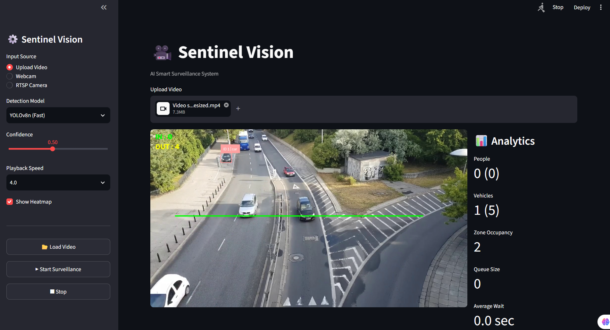
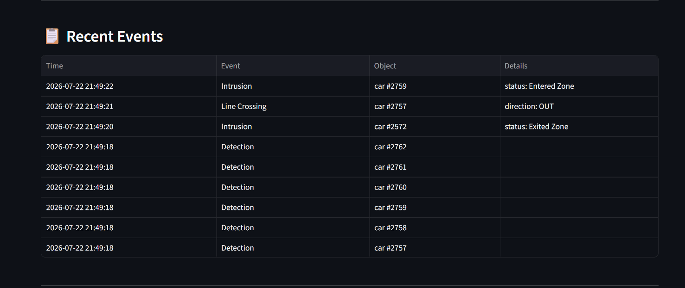
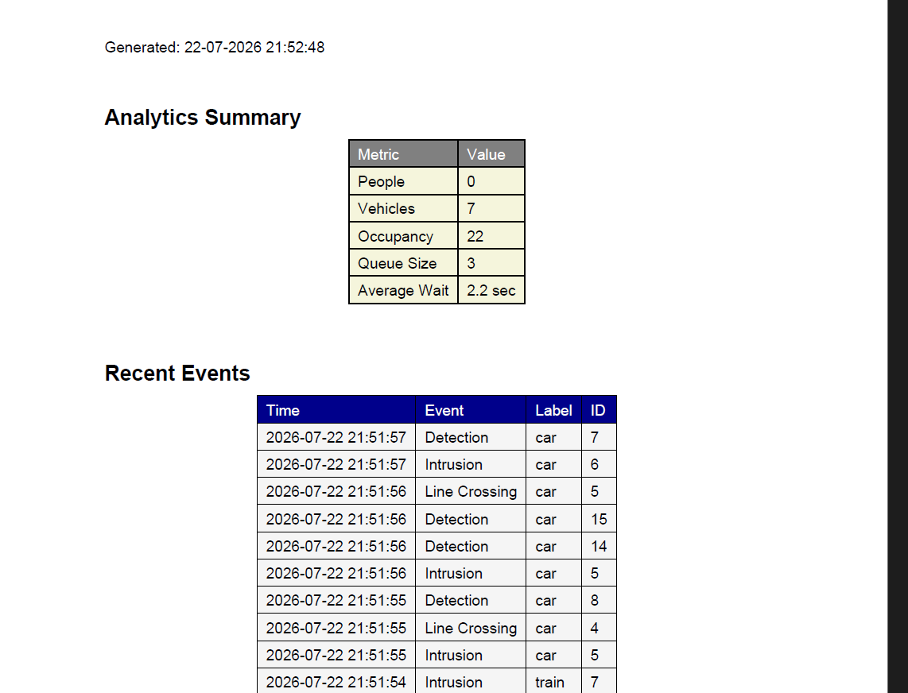

# 🎥 Sentinel Vision

An AI-powered Smart Surveillance System built using **YOLOv8**, **PyTorch**, **OpenCV**, **Supervision**, and **Streamlit**.

Sentinel Vision performs real-time object detection, multi-object tracking, surveillance analytics, and automated report generation from CCTV footage.

---

# Features

- 🎯 Real-time Object Detection
- 👥 Multi-Object Tracking (ByteTrack)
- 🚶 People Counting
- 🚗 Vehicle Counting
- ➖ Line Crossing Detection
- 🚧 Intrusion Detection
- ⏳ Loitering Detection
- 👨‍👩‍👧 Queue Monitoring
- 🚙 Speed Estimation
- 🔥 Heatmap Generation
- 📋 Event Logging
- 📊 CSV Report Export
- 📄 PDF Report Export
- ⚡ GPU Acceleration (CUDA)
- 🖥️ Interactive Streamlit Dashboard

---

# Tech Stack

## Deep Learning

- YOLOv8
- PyTorch

## Computer Vision

- OpenCV
- Supervision
- ByteTrack

## Dashboard

- Streamlit

## Reports

- ReportLab
- CSV

---

# Project Structure

```
SentinelVision/
│
├── analytics/
├── assets/
├── config/
├── core/
├── output/
├── reports/
├── services/
│
├── app.py
├── requirements.txt
├── README.md
└── .gitignore
```

---

# Installation

Clone the repository

```bash
git clone https://github.com/yourusername/SentinelVision.git
```

Move into the project directory

```bash
cd SentinelVision
```

Create a virtual environment

```bash
python -m venv venv
```

Activate the environment

Windows

```bash
venv\Scripts\activate
```

Linux / macOS

```bash
source venv/bin/activate
```

Install dependencies

```bash
pip install -r requirements.txt
```

---

# Run

```bash
streamlit run app.py
```

---

# Screenshots

## Dashboard

> *(Add dashboard screenshot here)*



---

## recent events

> *(Add recent events screenshot here)*



---

## PDF Report

> *(Add report screenshot here)*



---

# Performance

| Component | Details |
|------------|---------|
| Framework | PyTorch |
| Detection | YOLOv8 |
| Tracking | ByteTrack |
| GPU | NVIDIA RTX 2050 |
| Dashboard | Streamlit |

---

# Future Improvements

- Multi-camera support
- RTSP/IP Camera integration
- REST API
- Database storage
- Alert notifications
- Cloud deployment

---

# License

This project is licensed under the MIT License.

---

# Author

**Saqib Ahmad Khan**

GitHub: https://github.com/Saqib-0007

LinkedIn: https://www.linkedin.com/in/saqib-khan-11aba2309/